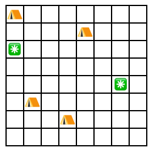

# Nearest Campsites I

A campground is represented as a grid where each square can contain a campsite that is either reserved or free. The
distance between two squares $(x_1, y_1)$ and $(x_2, y_2)$ is the Manhattan distance $|x_1 - x_2| + |y_1 - y_2|$.

Your task is to find the maximum distance from a free campsite to the nearest reserved campsite.

### Input

The first line has two integers $n$ and $m$: the number of reserved and free campsites.  
The next $n$ lines describe the locations of the reserved campsites. Each line has two integers $x$ and $y$.  
The next $m$ lines describe the locations of the free campsites. Each line has two integers $x$ and $y$.

You can assume that each square contains at most one campsite.

### Output

Print one integer: the longest distance to the nearest reserved campsite.

### Constraints

* $1 \le n, m \le 10^5$
* $1 \le x, y \le 10^6$

### Example

**Input:**

```
4 2
1 1
5 2
2 6
4 7
1 3
7 5
```

Output:

```
5
```

**Explanation:** The following figure shows the map of the campground:

In this case, the best choice is the free campsite on the right, whose distance to the nearest reserved campsite is 5.

