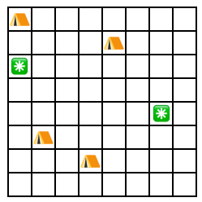

# Nearest Campsites II

A campground is represented as a grid where each square can contain a campsite that is either reserved or free. The
distance between two squares $(x_1, y_1)$ and $(x_2, y_2)$ is the Manhattan distance $|x_1 - x_2| + |y_1 - y_2|$.

Your task is to find the distance from each free campsite to the nearest reserved campsite.

### Input

The first line has two integers $n$ and $m$: the number of reserved and free campsites.  
The next $n$ lines describe the locations of the reserved campsites. Each line has two integers $x$ and $y$.  
The next $m$ lines describe the locations of the free campsites. Each line has two integers $x$ and $y$.

You can assume that each square contains at most one campsite.

### Output

Print $m$ integers: the distances from each free campsite to the nearest reserved campsite, in the input order.

### Constraints

* $1 \le n, m \le 10^5$
* $1 \le x, y \le 10^6$

### Example

**Input:**

```
4 2
1 1
5 2
2 6
4 7
1 3
7 5
```

Output:

```
2 5
```

**Explanation:** The following figure shows the map of the campground:
  
The distance from the first free campsite (on the left) to the nearest reserved campsite is 2, and the distance from the
second free campsite (on the right) to the nearest reserved campsite is 5.