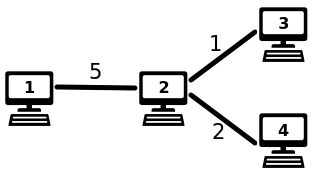

# Transfer Speeds Sum

A computer network has n computers and n-1 connections between two computers. Information can be exchanged between every
pair of computers using the connections.
Each connection has a certain transfer speed. Let d(a,b) denote the transfer speed between computers a and b, which is
the speed of the slowest connection on the route between a and b. Your task is to compute the sum of transfer speeds
between all pairs of computers.

### Input

The first line contains the integer n: the number of computers. The computers are numbered $1,2,\dots,n$.
After this, there are n-1 lines, which describe the connections. Each line has three integers a, b and x: there is a
connection between computers a and b with transfer speed x.

### Output

Print one integer: the sum of transfer speeds.

### Constraints

* $1 \le n \le 2 \cdot 10^5$
* $1 \le x \le 10^6$

### Example

**Input:**

```
4
1 2 5
2 3 1
2 4 2
```

Output:

```
12
```

**Explanation:**

The following figure corresponds to the sample input:

Here $d(1,2)=5, d(1,3)=1, d(1,4)=2, d(2,3)=1, d(2,4)=2$, and $d(3,4)=1$, so the sum of transfer speeds is 12.


