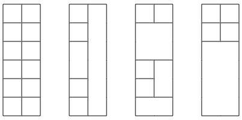

# Counting Towers

Your task is to build a tower whose width is 2 and height is n. You have an unlimited supply of blocks whose width and height are integers.
For example, here are some possible solutions for n=6:  
  
Given n, how many different towers can you build? Mirrored and rotated towers are counted separately if they look different.  

## Input
The first input line contains an integer t: the number of tests.
After this, there are t lines, and each line contains an integer n: the height of the tower.  

## Output

For each test, print the number of towers modulo 10<sup>9</sup>+7.

## Constraints

- 1 &le; n &le; 10<sup>6</sup>
- 1 &le; t &le; 100

## Example
<font color="blue">**Input:**</font>
```c++
3
2
6
1337
```
<font color="blue">**Output:**</font>
```c++
8
2864
640403945
``` 