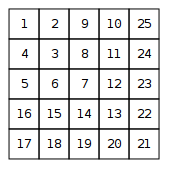

# Number Spiral

A number spiral is an infinite grid whose upper-left square has number 1. Here are the first five layers of the spiral:  


Your task is to find out the number in row y and column x.
## Input
The first input line contains an integer t: the number of tests.
After this, there are t lines, each containing integers y and x.
## Output
For each test, print the number in row y and column x.
## Constraints

- 1 &le; t &le; 10<sup>5</sup>  
- 1 &le; x, y &le; 10<sup>9</sup>
## Example
<font color="blue">**Input:**</font> 
```c++
3
2 3
1 1
4 2
```
<font color="blue">**Output:**</font>
```c++
8
1
13
```